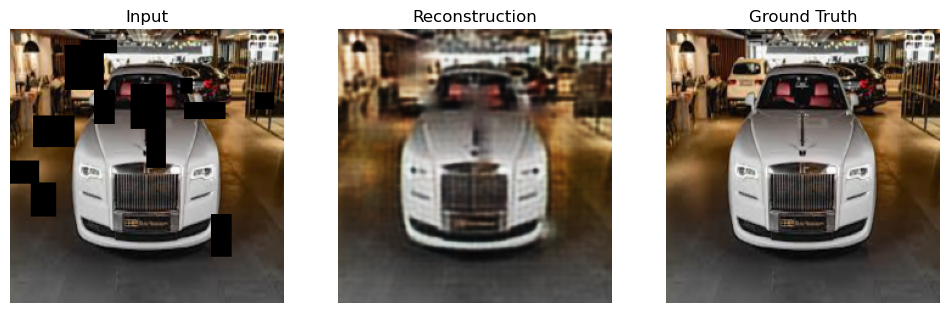

# Patch-Wise: Image Inpainting via Convolutional Autoencoders

**NOTE: This project is still a WIP**

Patch-Wise is a deep learning project that reconstructs corrupted images using a Convolutional Autoencoder built with PyTorch. It artificially corrupts training images by applying random black patches and trains a neural network to predict and fill in the missing spatial information (image inpainting), restoring the image to its original state.

## Project Overview

This repository demonstrates the ability of convolutional networks to learn spatial hierarchies and context. By mapping heavily corrupted inputs (with randomized missing patches) to clean ground-truth images, the model learns the underlying distribution of the image dataset (in this case, cars) and successfully performs denoising and inpainting.

### Key Features
* **Custom Patching Transform:** A dynamic `randomPatchify` class that generates random sizes and numbers of black patches on the fly during the dataloader phase.
* **Fully Convolutional Autoencoder:** An encoder-decoder architecture utilizing `Conv2d` for feature extraction and dimensionality reduction, and `ConvTranspose2d` for upsampling and reconstruction.
* **End-to-End Pipeline:** Complete workflow from data loading and augmentation to training, validation, and visual evaluation.

## Repository Structure

```text
patch-wise/
├── data/
│   └── cars/               # Directory containing the dataset (.jpg, .png)
├── notebooks/
│   └── main.ipynb          # Jupyter notebook with the full pipeline and visualizations
├── src/
│   ├── dataset.py          # Custom PyTorch Dataset and Patching Transforms
│   ├── model.py            # ConvAutoencoder architecture
│   └── utils.py            # Utility functions for patching and visualization
├── requirements.txt        # Project dependencies
└── README.md
```


## File Descriptions
* **dataset.py:** Contains the carsData class for loading images and applying transformations. It also houses randomPatchify, which handles the algorithmic application of randomized occlusions to simulate missing data
* **model.py:** Defines the ConvAutoencoder class. The encoder compresses the image from **$225 \times 225$ to a $15 \times 15$** latent space, and the decoder reconstructs it back to the original dimensions
* **main.ipynb:** The central hub for experimenting. It ties together the dataloaders, model instantiation, the PyTorch training loop (optimizing Mean Squared Error via Adam), and the matplotlib evaluation grids

### Prerequisites
Python 3.8+

### Installation
Clone the repository:
```Bash
git clone [https://github.com/FORTFANOP/patch-wise.git](https://github.com/FORTFANOP/patch-wise.git)
cd patch-wise
```
Install dependencies:
```Bash
pip install -r requirements.txt
```
(Note: Dependencies include torch, torchvision, pillow, opencv-python, and matplotlib)

### Results
The model is evaluated on a 20% validation split. Below is an example of the network's ability to reconstruct the missing information. All the reconstructions are blurry and hazy, mainly because of the simplicity of the architecture of the network and the loss that was used.
- MSE Loss (L2 loss) was used, which translates to a reduced net loss for taking an averag eof pixel values. This averaging appears as a blurry output
- Also, since this network is simple and does NOT include any skip connections (found in U-Net), there is a huge loss of information. In case of U-Net, the Decoder Net has access to the original image by use of these skip connections, however in our case, the decoder is completely reconstructing solely on the basis of the highly compressed latent vector.




## Future Improvements
- [ ] Advanced Architectures: Transitioning from a standard Autoencoder to a U-Net architecture (adding skip connections) to preserve high-frequency spatial details and reduce blurriness in the reconstruction
- [ ] Loss Function Upgrades: Replacing the standard Mean Squared Error (MSE) with a combination of Perceptual Loss (VGG) or Structural Similarity Index (SSIM) to encourage sharper, more visually realistic edges
- [ ] Adversarial Training: Implementing a Discriminator network to turn this into a Generative Adversarial Network (GAN), forcing the inpainting to look indistinguishable from real data
- [ ] Data Augmentation: Adding random horizontal flips, slight rotations, and color jitter to the base_transform to improve model generalization.